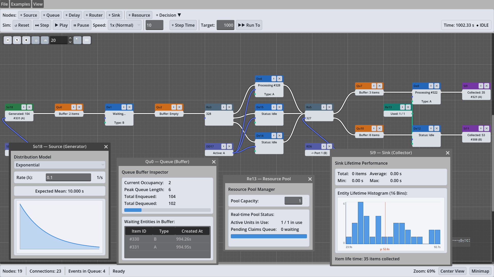

# GoSimDot Network Flow Editor (App)

> [!NOTE]
> **Work in Progress**: This visual editor is an experimental prototype and demonstration interface. It exemplifies how **GoSimDot**'s underlying discrete-event simulation engine can be driven via a node-based network flow editor built with Godot's `GraphEdit`.

---

## Overview

The application ([`app/graph_main.tscn`](file:///Users/matthias/git-repos/gosimdot/app/graph_main.tscn)) allows users to visually assemble, configure, run, and step through discrete-event queueing networks, assembly lines, and routing pipelines without writing code. Preconfigured networks can be loaded from the **Examples** menu or saved and loaded as JSON files (found in [`app/networks/`](file:///Users/matthias/git-repos/gosimdot/app/networks/)).

---

## Interface & Controls

### 1. Menu Bar
* **File**: `New` (clears canvas), `Open` (loads `.json` network), `Save`, `Save As`, and `Quit`.
* **Examples**: One-click loading of preconfigured models:
  * *Three Processing Stages* (`three_processing_stages.json`): Multi-stage manufacturing flow with routing decisions and shared resources.
  * *Resource Sharing* (`resource.json`): Competing servers claiming a constrained operational capacity pool.
  * *2-Way & 3-Way Routers* (`router_2way.json`, `router_3way.json`): Branching and distribution logic.
  * *Parallel Servers* (`parallel_servers.json`): Load distribution across parallel delay stations.
  * *Typed Service Delay* (`typed_service_delay.json`): Differentiated processing times based on entity attributes.
  * *Demo Network* (`demo.json`): Introductory pipeline.
* **View**: `Reset View` (re-centers canvas and resets zoom to 100%) and `Toggle Minimap`.

### 2. Top Toolbar

#### Node Creation Palette
* **`+ Source`**: Inter-arrival entity generator.
* **`+ Queue`**: FIFO buffer queue.
* **`+ Delay`**: Processing/service station.
* **`+ Router`**: Multi-output branch distributor.
* **`+ Sink`**: Entity collector and statistics recorder.
* **`+ Resource`**: Shared token capacity pool.
* **`+ Decision ▼`**: Dropdown menu for parameter modifier nodes:
  * `Source Probabilities` (`SD`): Entity type distribution weights.
  * `Delay Rules` (`DD`): Type-dependent service distributions.
  * `Routing Table` (`RD`): Port mapping and routing policies.

#### Simulation Execution & Playback
* **`↺ Reset`**: Resets simulation clock, Future Event Set (FES), and all node counters back to $t = 0$.
* **`⏭ Step`**: Advances execution to the very next discrete event in the schedule.
* **`▶ Play`**: Starts continuous animated simulation playback.
* **`⏸ Pause`**: Pauses ongoing continuous simulation.
* **`Speed`**: Controls real-time step interval (`1x (Normal)`, `2x (Fast)`, `5x (Rapid)`, `Max Speed`).
* **`+ Step Time`**: Advances the simulation forward by a relative time delta $\Delta t$ (configured via the adjacent spinbox).
* **`Target: [ T ] ▶▶ Run To`**: Runs simulation continuously until reaching the absolute target timestamp $T$.
* **Clock & Status Badge**: Displays current simulation time (`Time: X.XX s`) and real-time state badge (`● IDLE`, `● RUNNING`, `● PAUSED`, `● AT TARGET`, `● FINISHED`).

### 3. Bottom Status Bar
* **`Nodes`**: Total count of active graph nodes on the canvas.
* **`Connections`**: Total count of active wiring connections.
* **`Events in Queue`**: Number of scheduled events currently waiting in the Future Event Set.
* **Status Indicator**: Current engine status (`Ready`, `Finished`, etc.).
* **Canvas Controls**: Real-time zoom level, view reset, and minimap toggle.

---

## Graph Nodes

Each node type corresponds to an underlying GoSimDot simulation construct, featuring category color accents, live on-node status badges, an info inspector button (`ℹ`), and a delete button (`✕`):

### Processing & Flow Nodes

| Node | Prefix | Accent Color | Description | Live Node Badge |
| :--- | :---: | :--- | :--- | :--- |
| **Source** | `So` | Emerald Green | Generates simulation entities according to a configurable statistical inter-arrival distribution. | Displays total count generated and latest entity ID / type. |
| **Queue** | `Qu` | Amber Orange | FIFO buffer that holds entities waiting for downstream server availability, enforcing backpressure. | Displays current buffer count (e.g. `Buffer: 1 items`, `Buffer: Empty`). |
| **Delay** | `De` | Ocean Blue | Models a server or process station that delays an entity according to a service-time distribution (optionally claiming a Resource). | Displays operational state (`Processing #ID Type: X` or `Status: Idle`). |
| **Router** | `Ro` | Slate / Charcoal | Multi-port routing distributor that directs incoming entities to available downstream paths. | Displays processed routing entity ID. |
| **Resource** | `Re` | Teal | Models a finite, shared operational capacity pool (e.g., operators, tools) acquired and released by Delay servers. | Displays capacity utilization (`Used: X / Y`). |
| **Sink** | `Si` | Purple | Consumes completed entities exiting the network, tracking lifetime throughput and dwell time statistics. | Displays total collected count and last entity received. |

### Decision & Parameter Nodes

Parameter nodes connect to functional nodes via dedicated parameter ports to modify routing or distribution behavior dynamically:

| Node | Prefix | Accent Color | Description | Live Node Badge |
| :--- | :---: | :--- | :--- | :--- |
| **Source Decide** | `SD` | Lavender / Indigo | Assigns entity attributes (e.g., product types `A` vs. `B`) upon generation based on probability weights. | Displays assigned entity type. |
| **Route Decide** | `RD` | Lavender / Indigo | Directs entities across output branches based on entity properties or routing tables. | Displays active output port mapping. |
| **Delay Decide** | `DD` | Lavender / Indigo | Selects or overrides service-time distributions depending on entity properties (e.g. setup vs. processing time). | Displays active parameter rule. |

---

## Real-Time Inspectors & Analytics Windows

Clicking the `ℹ` icon on any node opens a floating, non-modal inspector dialog:

* **Source Inspector (`So`)**: Select inter-arrival distribution models (**Constant**, **Exponential**, **Normal**, **Uniform**, **Triangular**), adjust parameters (rate $\lambda$, mean, standard deviation, bounds), view expected mean values, and inspect a dynamic, continuous probability density function (PDF) curve plot.
* **Queue Buffer Inspector (`Qu`)**: Displays real-time buffer metrics including **Current Occupancy**, **Peak Queue Length**, **Total Enqueued**, **Total Dequeued**, a visual occupancy bar, and a live tabular list of waiting entities with their Item ID, Type, and creation timestamp.
* **Resource Pool Manager (`Re`)**: Configures pool capacity, monitors active units in use, tracks pending claims in the queue, and shows a capacity utilization progress bar.
* **Delay Server Inspector (`De`)**: Configures service-time distribution parameters with live PDF curves and displays linked resource constraints and server state.
* **Sink Lifetime Performance & Histogram (`Si`)**: Summarizes network throughput metrics (**Total entities**, **Average dwell time**, **Min**, **Max**) and renders an interactive **16-bin entity lifetime histogram** complete with sample mean marker ($\mu$) to analyze cycle time distributions across the network.

---

*Note: This documentation was generated with AI assistance (Gemini) and reviewed by the maintainer.*
