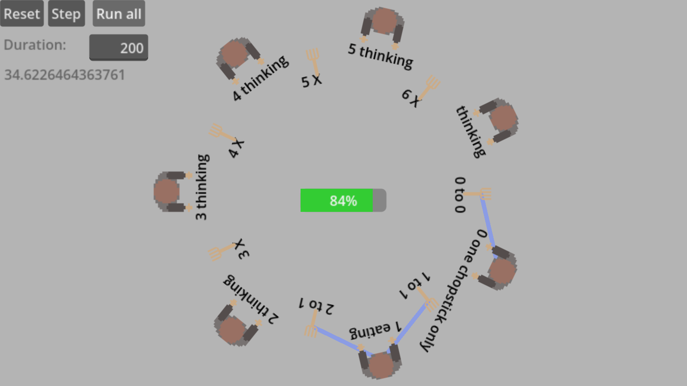
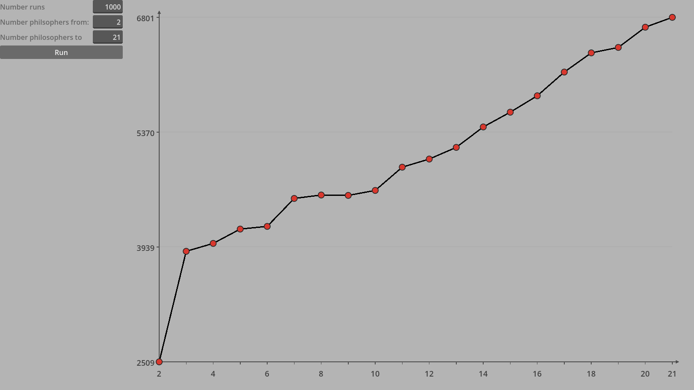

# Dining Philosophers Example

This directory contains implementations of the classic **Dining Philosophers problem** (first formulated by Edsger Dijkstra) adapted to the **Three-Phase (ABC) discrete-event simulation worldview** in GoSimDot.

The model showcases how GoSimDot handles contention over shared resources, asymmetrical deadlock prevention, multi-resource and container synchronization, state machines, and starvation timeouts without thread locks or polling loops.

---

## Overview

$N$ philosophers sit around a circular table. Between each pair of adjacent philosophers lies a single chopstick (modelled as a `SimulationResourceManaged` with capacity 1). Each philosopher alternately thinks, becomes hungry, acquires their adjacent chopsticks, and eats.

Because each chopstick is shared between two neighbors, adjacent philosophers cannot eat simultaneously.

The three models implemented here correspond directly to the progressive Dining Philosophers examples presented in **D. Zinoviev, *Discrete Event Simulation: It's Easy with SimPy!* (2024)**, translating the process-interaction paradigm of SimPy into the declarative Three-Phase (ABC) worldview of GoSimDot:

1. **Level 1 (Classic Contention & Asymmetry):** Standard chopsticks contention with asymmetric acquisition to avoid circular deadlock.
2. **Level 2 (Shared Food Bowl & Chef):** Philosophers must acquire both chopsticks *and* take food from a shared `SimulationContainer` refilled periodically by an autonomous `Chef`.
3. **Level 3 (Timeouts & Starvation Avoidance):** Philosophers waiting at an empty food bowl can time out, release their held chopsticks to prevent starvation deadlocks, and back off to rethink before retrying.

---

## Simulation Architecture

### 1. State Machine (`SimulationStateMachine`)

Each philosopher is implemented as a finite state machine extending `SimulationStateMachine`:

```
                ┌───────────────┐
                │   THINKING    │◄──────────────────────────┐
                └───────┬───────┘                           │
                        │ thinking_time_dist (B-Event)      │
                        ▼                                   │
                ┌───────────────┐                           │
         ┌─────►│    HUNGRY     │                           │
         │      └───────┬───────┘                           │
         │              │ PhilosopherCCondition (Left Fork) │
         │              ▼                                   │
         │      ┌─────────────────────┐                     │
         │      │ TAKE FIRST CHOPSTICK│                     │
         │      └───────┬─────────────┘                     │
         │              │ taking_time_dist (B-Event)        │
         │              ▼                                   │
         │      ┌─────────────────────┐                     │
         │      │ ONE CHOPSTICK ONLY  │                     │
         │      └───────┬─────────────┘                     │
         │              │ PhilosopherCCondition (Right Fork)│
         │              ▼                                   │
(Timeout in L3) ┌─────────────────────┐                     │
         │      │      GET FOOD       │ (Level 2 & Level 3) │
         │      │  (FoodBowlCCondition│                     │
         │      └───────┬─────────────┘                     │
         │              │ food acquired                     │
         │              ▼                                   │
         │      ┌─────────────────────┐                     │
         └──────┤       EATING        ├─────────────────────┘
                └─────────────────────┘ eating_time_dist (B-Event)
```

- **`THINKING`:** The philosopher spends an exponentially distributed interval thinking (`thinking_time_dist`), after which an event schedules a transition to `HUNGRY`.
- **`HUNGRY`:** Waiting to acquire the first chopstick. A `SimulationCCondition` observes the resource.
- **`TAKEFIRSTCHOPSTICK`:** A deterministic delay (`taking_time_dist`) representing the physical action of picking up the utensil.
- **`ONECHOPSTICK` (`HungyWithOneChopstick`):** The philosopher holds one chopstick and waits for the second via a second `SimulationCCondition`.
- **`GETFOOD` (Levels 2 & 3):** Holding both chopsticks, the philosopher waits for sufficient food to be available in the communal `SimulationContainer`.
- **`EATING`:** The philosopher consumes food for a duration sampled from `eating_time_dist`. Upon completion, both chopsticks are released and the philosopher transitions back to `THINKING`.

### 2. Deadlock Avoidance (Asymmetric Assignment)

If all philosophers simultaneously pick up their left chopstick first, a circular dependency forms and the system deadlocks.

GoSimDot breaks circular symmetry in `create_philosophers()`:
- Philosophers $0 \le i < N - 1$ first request their left chopstick `chopsticks[i]`, then their right chopstick `chopsticks[(i + 1) % N]`.
- The last philosopher ($i = N - 1$) reverses this order: acquiring `chopsticks[(i + 1) % N]` (chopstick 0) first, then `chopsticks[i]`.

### 3. Conditional Activities (Phase C)

Acquiring chopsticks and taking food are cooperative conditional activities evaluated in **Phase C**:
- `PhilosopherCCondition`: Watches both the chopstick resource and the philosopher state. Whenever a chopstick is released, `is_true()` checks `philosopher.can_acquire(chopstick)` and assigns it without polling.
- `FoodBowlCCondition`: Watches the `SimulationContainer` and fires `on_container_got()` once sufficient food is available.

---

## Progressive Implementations

| Level | Orchestrator Script | Philosopher Script | Key Features |
|---|---|---|---|
| **Level 1** | `dining_philosophers.gd` | `philosopher.gd` | Basic circular table, asymmetric chopstick acquisition, waiting time metrics. |
| **Level 2** | `dining_philosophers2.gd` | `philosopher2.gd` | Adds shared `SimulationContainer` (`food_bowl`), portions, and autonomous `Chef` replenishment. |
| **Level 3** | `dining_philosophers3.gd` | `philosopher3.gd` | Adds scheduled timeout detection in `GETFOOD`. Re-releases held chopsticks to prevent starvation, accumulating appetite until the next attempt. |

---

## File Structure

```
dining_philosophers/
├── README.md                           # This documentation
├── dining_philosophers.gd              # Level 1 coordinator node
├── dining_philosophers2.gd             # Level 2 coordinator node (with food bowl)
├── dining_philosophers3.gd             # Level 3 coordinator node (with timeouts)
├── philosopher.gd                      # Level 1 philosopher state machine
├── philosopher2.gd                     # Level 2 philosopher state machine
├── philosopher3.gd                     # Level 3 philosopher state machine
├── philosopher_c_condition.gd          # Phase C condition for chopstick acquisition
├── philosopher_c_condition2.gd         # Phase C condition for Level 2
├── philosopher_c_condition3.gd         # Phase C condition for Level 3
├── food_bowl_c_condition2.gd           # Phase C condition for food container (Level 2)
├── food_bowl_c_condition3.gd           # Phase C condition for food container (Level 3)
├── chef.gd                             # Chef entity that periodically replenishes food bowl
├── headless.gd                         # Headless parameter sweep across N = 2..21
├── headless.tscn                       # Scene for headless execution
│
├── animation/                          # 2D Interactive Visualizations
│   ├── dining_philosophers_animation.gd    # 2D visualization script (Level 1)
│   ├── dining_philosophers_animation.tscn  # 2D visualization scene (Level 1)
│   ├── dining_philosophers_animation2.gd   # 2D visualization script (Level 2)
│   ├── dining_philosophers_animation2.tscn # 2D visualization scene (Level 2)
│   ├── dining_philosophers_animation3.gd   # 2D visualization script (Level 3)
│   ├── dining_philosophers_animation3.tscn # 2D visualization scene (Level 3)
│   ├── philosopher.tscn / fork.tscn        # Visual sprite nodes
│   └── *.png                               # Sprites for philosophers and forks
│
└── plotting/                           # Real-time Benchmark Plotting UI
    ├── dining_philosophers_plotting.gd     # UI controller for sweeps
    ├── dining_philosophers_plotting.tscn   # Control UI scene with Line2D plot
    └── draw_plot.gd                        # Dynamic 2D canvas curve renderer
```

---

## How to Run

### 1. Headless Benchmarks

Execute parameter sweeps (testing $N = 2 \dots 21$ philosophers over 50,000 simulation steps) directly from the command line:

```bash
# Run headless simulation script
godot --headless -s examples/dining_philosophers/headless.gd

# Or run headless scene directly
godot --headless examples/dining_philosophers/headless.tscn
```

### 2. 2D Visual Animation

Run any of the 2D visual scenes in the Godot Editor or via CLI to see the philosophers arranged radially, with real-time state labels and dynamic line links to acquired forks:



```bash
# Level 1: Classic model
godot examples/dining_philosophers/animation/dining_philosophers_animation.tscn

# Level 2: Food bowl & Chef model
godot examples/dining_philosophers/animation/dining_philosophers_animation2.tscn

# Level 3: Starvation timeout model
godot examples/dining_philosophers/animation/dining_philosophers_animation3.tscn
```

### 3. Interactive Plotting Dashboard

Launch the plotting interface to run synchronous batch replications and visualize average waiting times across varying philosopher counts:



```bash
godot examples/dining_philosophers/plotting/dining_philosophers_plotting.tscn
```

---

## References

- Edsger W. Dijkstra, *Hierarchical Ordering of Sequential Processes*, Acta Informatica, 1971.
- Dmitry Zinoviev, *Discrete Event Simulation: It's Easy with SimPy!*, Pragmatic Bookshelf, 2024.

---

*Note: This documentation was generated with AI assistance (Gemini) and reviewed by the maintainer.*

