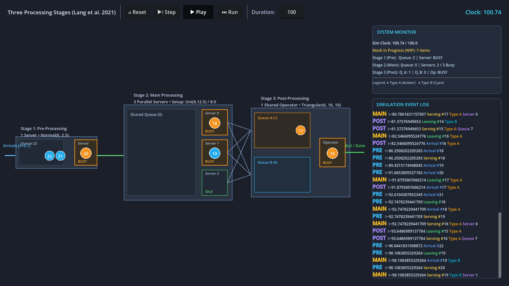

# Three Processing Stages Example

This directory contains an implementation of the benchmark reference scenario from **Lang et al. (2021)**, modeling a multi-stage production and logistics line using the **Three-Phase (ABC) discrete-event simulation worldview** in GoSimDot.

The scenario demonstrates complex discrete-event dynamics: stochastic arrivals, single- and multi-server stages, sequence-dependent setup times, typed routing, dedicated multi-queues, and shared resource operators.

---

## Benchmark Scenario (Lang et al., 2021)

The model reproduces the reference case study formulated in:
> **S. Lang, C. Reggelin, M. Müller, and N. Nahhas (2021)**  
> *Open-source discrete-event simulation software for applications in production and logistics: An alternative to commercial tools?*  
> Procedia Computer Science, Vol. 180, pp. 978–987.

### Workflow & Product Types

Items of two types (**Type A** and **Type B**, each generated with 50% probability via `Decider.ProbablisticDecider`) enter the system and pass sequentially through three distinct stages:

```
[Arrivals (λ=0.1)]
       │
       ▼
┌───────────────────────────────┐
│     Stage 1: Pre-Processing   │
│  1 Server • Normal(6, 2.5)    │
│  Single FIFO Queue            │
└──────────────┬────────────────┘
               │
               ▼
┌───────────────────────────────┐
│     Stage 2: Main Processing  │
│  3 Parallel Servers           │
│  Setup-dependent Service:     │
│   • Same type: Const(8.0)     │
│   • Type switch: Uni(8, 12.5) │
│  Shared FIFO Queue            │
└──────────────┬────────────────┘
               │
         ┌─────┴─────┐
         ▼           ▼
┌───────────────────────────────┐
│     Stage 3: Post-Processing  │
│  Dedicated Queue A (Type A)   │
│  Dedicated Queue B (Type B)   │
│  1 Shared Operator (Triangular)
└──────────────┬────────────────┘
               │
               ▼
        [System Exit / Done]
```

### Stage Specifications & Distributions

| Stage | Servers / Capacity | Queue Configuration | Service Time Distribution | Behavior |
|---|---|---|---|---|
| **Arrivals** | — | — | **Exponential** ($\lambda = 0.1$) | Continuous Poisson arrival process generating items tagged as Type A or B. |
| **1. Pre-Processing** | 1 Server (`SimulationResource`) | Single FIFO queue | **Normal** ($\mu = 6.0, \sigma = 2.5$) | Single-server service station. Coordinated via `PreProcessingStageCCondition`. |
| **2. Main Processing** | 3 Parallel Servers (`SimulationResource`) | Single shared FIFO queue | • **Constant** ($8.0$) without setup<br>• **Uniform** ($[8.0, 12.5]$) with setup | Sequence-dependent setup: if a server processes a different type than its preceding job, setup is incurred. |
| **3. Post-Processing** | 1 Shared Operator (`SimulationResourceManaged`) | 2 Dedicated Queues (Queue A, Queue B) | **Triangular** ($\text{min}=6, \text{max}=16, \text{mode}=10$) | Multi-queue contention: single shared operator serves whichever queue is ready. |

---

## Three-Phase (ABC) Coordination

All activities in this simulation follow the Three-Phase worldview:
- **Phase A (Clock Advance):** Advances simulation time to the earliest scheduled event in the Future Event Set.
- **Phase B (Deterministic Events):** Executes time-scheduled completions (service finishes, next arrival).
- **Phase C (Conditional Activities):** Evaluates state-dependent starts without busy-waiting:
  - `PreProcessingStageCCondition`: Triggers when Pre server is available and Pre queue is non-empty.
  - `MainProcessingStageCCondition`: Triggers when any of the 3 Main servers is available and Main queue is non-empty.
  - `PostProcessingStageCCondition`: Triggers when the shared operator is available and either Queue A or Queue B is non-empty.

---

## Visual Interactive Dashboard

The visualization (`three_processing_stages_vis.tscn`) is built to scale across a **1600×900** viewport:



- **Flow Canvas (Left / Center):**
  - **Type-Coded Tokens:** Items rendered with distinct color coding (Amber for Type A, Cyan for Type B) and centered sim IDs.
  - **Live Queue Buffers:** Real-time token tracks showing items waiting in FIFO order with overflow badges (`+N`).
  - **Server Bay Stations:** Distinct stations showing `IDLE` vs `BUSY` states, active item tokens, and setup indicators.
  - **Symmetric Flow Connectors:** Directional links showing arrivals, inter-stage transfer, and multi-queue routing to the operator.
- **Control Bar (Top):**
  - **`▶❘ Step`:** Advances by one discrete event (Phase A $\rightarrow$ B $\rightarrow$ C) and pauses.
  - **`▶ Play` / `⏸ Pause`:** Continuously steps the simulation in real time (~5 steps/sec), visually streaming item flows.
  - **`⏭ Run`:** Instantly simulates the full target duration synchronously.
  - **`↺ Reset`:** Restores all queues, servers, and clocks to initial state.
- **System Monitor & Event Log (Right):**
  - **System Monitor:** Real-time KPI summary (clock time, work-in-progress WIP, queue lengths, server status).
  - **Event Log:** Live scrollable activity feed with color-coded BBCode highlights for arrivals, services, and departures.

---

## File Structure

```
processing_stages/
├── README.md                      # This documentation
├── three_processing_stages.gd     # Simulation orchestrator (models the scenario)
├── three_processing_stages.tscn   # Headless simulation scene
├── pre_processing_stage.gd        # Stage 1 logic (1 server, normal distribution)
├── main_processing_stage.gd       # Stage 2 logic (3 servers, setup-dependent)
├── post_processing_stage.gd       # Stage 3 logic (2 queues, 1 shared operator)
│
├── three_processing_stages_vis.gd # Visualization controller & playback loop
├── three_processing_stages_vis.tscn # 1600x900 interactive dashboard scene
├── sim_control_bar.tscn           # Control header bar (Reset, Step, Play, Run)
├── log_rich_text_label.gd         # BBCode-formatted auto-scrolling log
├── pre_polygon_2d.gd              # Stage 1 canvas renderer (queue & server bay)
├── main_polygon_2d.gd             # Stage 2 canvas renderer (queue & 3 server bays)
└── post_polygon_2d.gd             # Stage 3 canvas renderer (2 queues & operator)
```

---

## How to Run

### Interactive Visual Dashboard

Run the visualization in the Godot Editor or from the terminal:

```bash
godot examples/processing_stages/three_processing_stages_vis.tscn
```

### Headless Execution

To run the simulation headlessly:

```bash
godot --headless examples/processing_stages/three_processing_stages.tscn
```

---

## References

- S. Lang, C. Reggelin, M. Müller, and N. Nahhas, *Open-source discrete-event simulation software for applications in production and logistics: An alternative to commercial tools?*, Procedia Computer Science, Vol. 180, pp. 978–987, 2021.

---

*Note: This documentation was generated with AI assistance (Gemini) and reviewed by the maintainer. The visualization interface, window scaling (1600×900), and interactive controls were also improved using Gemini.*
